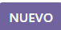

#  google_image
## Descripcion
Nombre del modulo: Google images
Este módulo de Odoo 16 facilita la integración de imágenes a los productos utilizando la API de Google Custom Search. Permite buscar imágenes asociadas a los productos a través de códigos de barras y también proporciona la funcionalidad para cargar imágenes adicionales para ser utilizadas en el módulo de e-commerce de Odoo 16.

## Para que se va a usar
El proyecto consiste en un modulo de odoo16 al que se le implementara Google api “Custom Search” para traer imágenes de Google usando el código de barras de los productos.Esto con la finalidad de ayudar a que el departamento de almacén minimice tiempos y agilice procesos de registros de productos, haciendo automático el proceso de la carga de elementos multimedia.

## Requisitos de odoo

Los requerimientos para realizar el proyecto es primeramente de la parte de odoo, se deben de instalar unos cuantos modulos:
* Modulo de inventario: Se necesita crear este modulo para heredar de el el modelo de product.template para poder usar elementos de la plantilla de productos,vistas,clases, ids y demas elementos de los que dispone el modelo. Este ademas de instalarlo en la interface de odoo se tiene que agregar como dependencia en el manifest.

* Modulo de venta: Este modulo se necesita para heredar tambien elementos y secciones que se van a necesitar para poder agregar imagenes en el apartado de imagenes adicionales del producto.

* Modulo de ecomerce: Este modulo es necesario ya que con este los elementos guardados de las imagenes adicionales y demas, se puedan agregar a este modulo para la venta en linea.

* Modulo para leer codigos de barra: Ese modulo se necesita para poder leer codigos de barras con un lector. Este ademas de instalarlo en la interface de odoo se tiene que agregar como dependencia en el manifest.

## Requisitos externos

* Api de google: Para la api se tienen que seguir una serie de pasos para poder configurar u obtener la llave los cuales son:
    - Vaya a la página de Google Cloud Platform API & Services para generar credenciales de API para la búsqueda personalizada de Google. Aqui el enlace https://console.developers.google.com/ 
    - Inicie sesión con su cuenta de Google.
    - Seleccione o cree un proyecto API para almacenar las credenciales. Nómbrelo con un título específico (por ejemplo, imágenes de Odoo).
    - En la sección de credenciales, haga clic en Crear credenciales y seleccione Clave API

Y listo una vez echo esto deberia de obtener una llave.¡Guardelo!

* Buscador de api de google (Custom search): Para el buscador se siguen estos pasos: 
    - Vaya al Motor de Búsqueda Programable de Google y haga clic en Comenzar. 
    - Inicie sesión con su cuenta de Google. Seleccione el idioma y el nombre del motor de búsqueda. 
    - Nómbrelo con un título específico (por ejemplo, Imágenes de Odoo). 
    - Valide el formulario haciendo clic en Crear, después vaya al modo de edición del motor de búsqueda que creó (haciendo clic en Panel de control en la página de confirmación o en el nombre de su motor de búsqueda en la página de inicio). 
    - En la pestaña de elementos básicos, asegúrese de habilitar la búsqueda de imágenes, SafeSearch y buscar en toda la web. Este es el enlace para acceder a la web del motor: https://programmablesearchengine.google.com/.

Y listo una vez echo esto deberia de obtener una el id del buscador programable.¡Guardelo!

# Uso

## Instalación
* Clona o descarga el repositorio del módulo.
* Coloca el directorio del módulo en la ruta de addons de tu instalación de Odoo.
* Reinicia el servidor Odoo.
* Instala el módulo desde la interfaz de administración de Odoo.

## Configuración
* Una vez instalado, dirígete a la configuración de Odoo. Busca el menú de configuración del módulo de imágenes de productos.
* Completa los parámetros de la API de Google Custom Search, incluyendo la API Key, ID del buscador, número de imágenes a obtener, tipo de archivo y tamaño de imagen.

## Modo de utilizacion
Para el uso de las funciones del modulo se tiene que hacer lo siguiente:
* Dirigirse al modulo de inventario/ventas
* Entrar a la seccion de los productos
* Si es un nuevo producto:
    - Dar clic al boton 
    

## Integración con el Módulo de e-Commerce de Odoo 16
Las imágenes asociadas a los productos se integran automáticamente con el módulo de e-commerce de Odoo 16, proporcionando una experiencia visual completa para los clientes.

## PARAMETROS DE CONSULTA DEL MOTOR DE BUSQUEDA
El motor de busqueda cuenta con bastantes parametros que se le pueden configurar, sin embargo estos se tienen que usar con cautela ya que estos limitan la busqueda de recursos en la web, los parametros son:
* c2coff: Habilita o inhabilita la Búsqueda en chino tradicional y simplificado. El valor predeterminado de este parámetro es 0 (cero), lo que significa que la función está habilitada. Los valores admitidos son los que se detallan a continuación:
1: Inhabilitado
0: Habilitado (predeterminado)

* cr: Restringe los resultados de la búsqueda a los documentos que se originan en un país en particular. Puedes usar operadores booleanos en el valor del parámetro cr. Para determinar el país de un documento, la Búsqueda de Google analiza lo siguiente:
    - El dominio de nivel superior (TLD) de la URL del documento
    - la ubicación geográfica de la dirección IP del servidor web
    - Consulta la página Valores de parámetros de país a fin de obtener una lista de valores válidos para este parámetro.

* cx: Es el id del motor de busqueda programable

* dateRestrict: Restringe los resultados a las URLs según la fecha. Entre los valores admitidos, se incluyen los siguientes:

    - d[number]: Solicita resultados de la cantidad especificada de días anteriores.
    - w[number]: Solicita resultados de la cantidad especificada de semanas anteriores.
    - m[number]: Solicita resultados de la cantidad especificada de meses anteriores.
    - y[number]: Solicita resultados de la cantidad especificada de años anteriores.

* exactTerms: Identifica una frase que deben contener todos los documentos de los resultados de búsqueda.

* excludeTerms: Identifica una palabra o frase que no debería aparecer en ningún documento de los resultados de la búsqueda.

* fileType: Restringe los resultados a los archivos de una extensión especificada. Puedes encontrar una lista de los tipos de archivos indexables por Google en el Centro de ayuda de Search Console.

* filter: Controla la activación o desactivación del filtro de contenido duplicado.De forma predeterminada, Google filtra todos los resultados de la búsqueda para mejorar su calidad. Los valores aceptables son:
    - 0: Desactiva el filtro de contenido duplicado.
    - 1: Activa el filtro de contenido duplicado.

* gl: Ubicación geográfica del usuario final. El valor del parámetro gl es un código de país de dos letras. El parámetro gl potencia los resultados de la búsqueda cuyo país de origen coincide con el valor del parámetro. 

* hq: Agrega los términos especificados a la consulta, como si se combinaran con un operador lógico AND.

* imgColorType: Muestra imágenes en blanco y negro, en escala de grises, transparentes o en color. Los valores aceptables son:
    - "color"
    - "gray"
    - "mono": blanco y negro
    - "trans": fondo transparente

* imgDominantColor: Muestra imágenes de un color dominante específico. Los valores aceptables son:
    - "black"
    - "blue"
    - "white"

Entre otros

* imgSize: Muestra imágenes de un tamaño especificado. Los valores aceptables son:
    - "huge": Es el tamaño mas grande soportado
    - "icon": Tamaño icono
    - "large": Tamaño Grande
    - "medium": Mediano
    - "small": Pequeño
    - "xlarge": Extra grande
    - "xxlarge": Mucho mas grande 

* imgType: Muestra imágenes de un tipo. Los valores aceptables son:
    - "clipart"
    - "face"
    - "lineart"
    - "stock"
    - "photo"
    - "animated"

* linkSite: Especifica que todos los resultados de la búsqueda deben contener un vínculo a una URL en particular.

* lr: Restringe la búsqueda a los documentos escritos en un idioma en particular (p.ej., lr=lang_ja). Los valores aceptables son:

    - "lang_ar": Árabe
    - "lang_en": inglés
    - "lang_es": Español
    - "lang_fr": Francés
    - "lang_it": Italiano
    - "lang_ja": Japonés
    - "lang_ko": Coreano
    - "lang_ru": Ruso
Entre otros

* num:Cantidad de resultados de la búsqueda que se mostrarán. Los valores válidos son números enteros entre 1 y 10, inclusive.

* q: Es lo que se quiere consultar

* rights: Filtros basados en licencias. Entre los valores admitidos, se incluyen cc_publicdomain, cc_attribute, cc_sharealike, cc_noncommercial, cc_nonderived y combinaciones de estos. 

* safe: Nivel de seguridad de búsqueda. Los valores aceptables son:
    - "active": Habilita el filtro SafeSearch.
    - "off": Inhabilita el filtro SafeSearch. (predeterminado)

* searchType: Especifica el tipo de búsqueda: image. Si no se especifica, los resultados se limitan a páginas web.Los valores aceptables son:
    - "image": búsqueda con imágenes personalizadas
* siteSearch: Especifica un sitio determinado que siempre debe incluirse o excluirse de los resultados.

* siteSearchFilter: Controla si se incluyen o se excluyen resultados del sitio que se menciona en el parámetro siteSearch. Los valores aceptables son:
    - "e": excluir
    - "i": incluir

* sort: La expresión de orden que se aplica a los resultados. El parámetro ordenar especifica que los resultados se ordenarán de acuerdo con la expresión especificada, es decir, se ordenarán por fecha. Ejemplo: sort=date.
